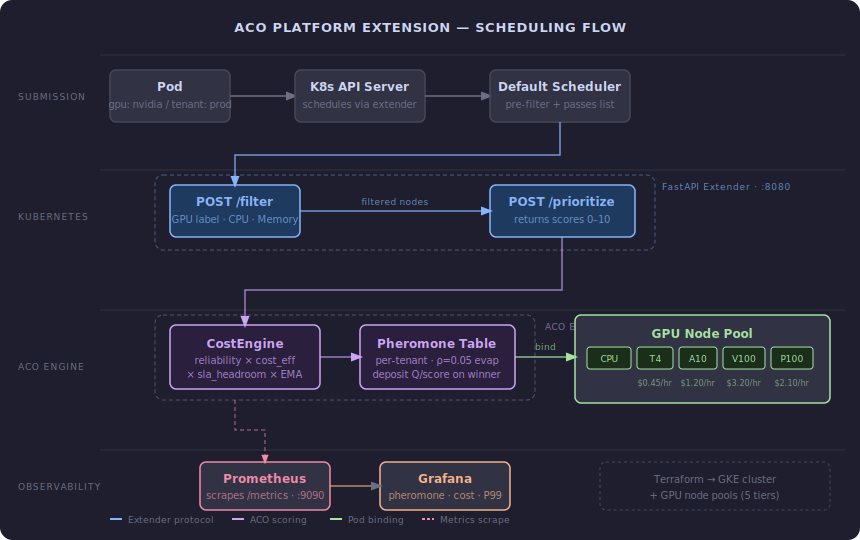
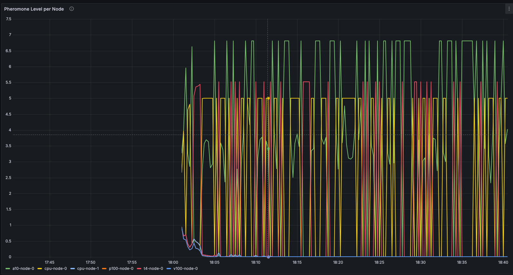

# ACO Platform Extension

Platform extension for the [ACO Adaptive Compute Orchestrator](https://github.com/Aravind0403/ACO_Adaptive_Compute_Orchestrator) research repo.

Turns the scheduling algorithm (validated via 14-way ablation, under peer review) into a deployable Kubernetes system with full observability. EMA (α=0.5) outperformed LSTM by 13.8pp on safe-node routing — 89.2% vs 75.4% — at zero training cost.

---

## Architecture



---

## Pheromone Convergence (Live Grafana)

The colony starts cold. Within ~25 scheduling calls, trails diverge: the A10 node dominates at pheromone level ~6.8, CPU and T4 settle in the mid-tier, V100 and P100 sit near the floor. The hierarchy is learned, not configured.



---

## Quick start (no GKE required)

```bash
git clone https://github.com/Aravind0403/ACO_Platform_Extension
cd ACO_Platform_Extension
chmod +x scripts/demo-local.sh
./scripts/demo-local.sh
```

Open Grafana at `http://localhost:3000` (admin / admin) → ACO Scheduler — Platform Extension dashboard.

Run `curl -X POST http://localhost:8080/reset` to reset pheromone trails between demo runs.

---

## What's in here

| Directory | What it does |
|---|---|
| `core/` | Core modules imported from the research repo (ACO engine, predictor, cost engine) |
| `extender/` | Kubernetes scheduler extender — FastAPI service exposing `/filter` + `/prioritize` |
| `observability/` | Prometheus config + Grafana dashboard (pheromone, cost/job, P99 latency) |
| `terraform/` | GKE cluster + 5 GPU node pools (CPU, T4, A10, V100, P100) |
| `k8s/` | Scheduler config, namespace-per-tenant manifests, ResourceQuota |
| `scripts/` | Trace replay driver + demo startup script |

---

## Key numbers

- EMA α=0.5 → 89.2% safe-node routing vs LSTM 75.4% — 13.8pp gap, zero training cost
- P99 scheduling latency < 0.75ms across 1–200 concurrent jobs
- Cost floor: $0.45/hr (T4) → $3.20/hr (V100) — colony learns the gradient without explicit rules
- 3 tenants (research / prod / dev) with isolated pheromone tables and namespace ResourceQuota

---

## Build sequence

1. **Phase 1** — K8s scheduler extender (FastAPI `/filter` + `/prioritize`)
2. **Phase 2** — Prometheus + Grafana observability
3. **Phase 3** — Terraform GKE with GPU node pools
4. **Phase 4** — Multi-tenant isolation (namespace-per-tenant + per-tenant pheromone tables)

---

## Requirements

- Python 3.11+
- Docker (OrbStack works)
- Terraform ≥ 1.6 (Phase 3 / GKE only)
- kubectl

---

## Technical write-up

[Wiring Ants Into Kubernetes](https://aravind0403.github.io/wiring-ants-into-kubernetes/) — extender protocol, ACO scoring, what broke during the build, and what Grafana shows.
